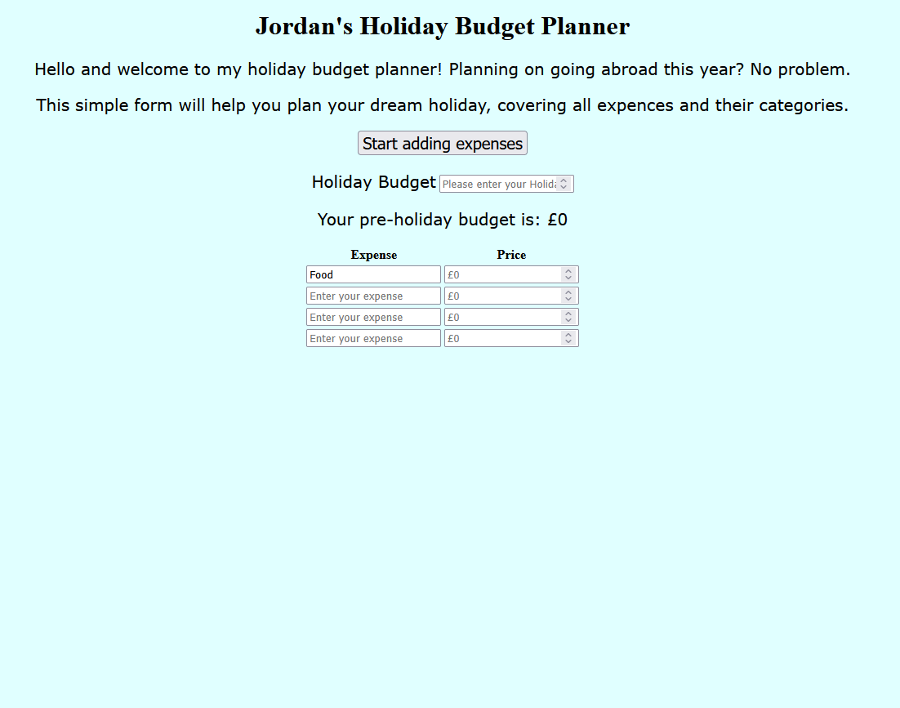
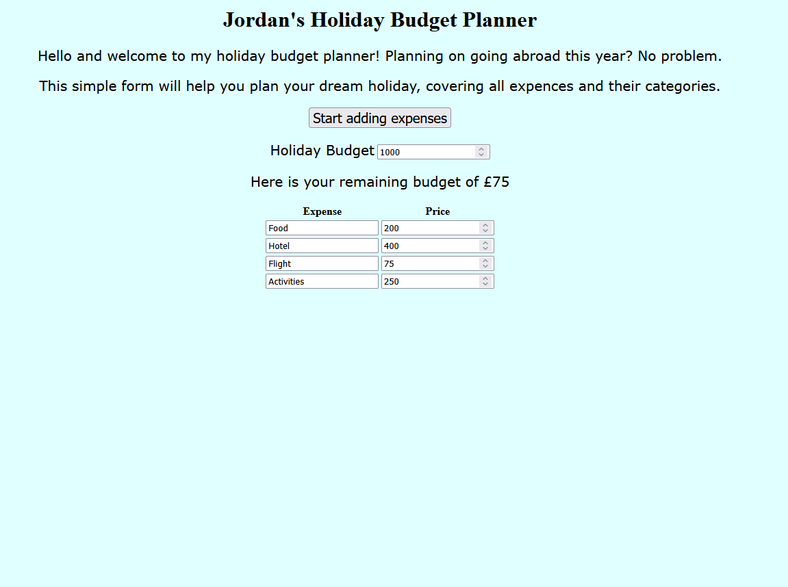

# holiday-budget-planner

# Table of Contents 

- [What is the purpose of the application?](#what-is-the-purpose-of-the-application?)
- [User interaction](#user-interaction)
- [Application setup](#application-setup)
- [Visuals/Styling](#visualsstyling)
- [Automated and Manual Testing](#automated-and-manual-testing)
- [Testing](#testing)
- [Screenshots/user stories](#screenshotsuser-stories)
- [Testing summary](#testing-summary)
- [Development process](#development-process)

## What is the purpose of the application?
The purpose of this application is to help people with their basic travel budget needs. Going on holiday is an exciting time.
But also, a stressful one if you don't come prepared. This is why the application is basic, simple to read, and will allow you to knuckle down to the basics of travel.
For example, hotels, flights, food, and activities I have researched is the four basic components when budgeting for a trip.

The application is easy to use and flows smoothly. You are addressed with the introduction sentence, followed by a sentence targetted at making the user feel comfortable.
This is followed by the button that confirms your budget, and the table which allows user input for the four most important categories of travel budgeting.

## User interaction

When you are first loaded into the application, and read through the introduction text, users will feel obliged to click the button to start the process. They will, however, be met with a message that appears below the button, stating they must enter in their pre-holiday budget. This is the figure they will begin their budgeting plan with. Say £500, for example. Once they have clicked on the button afterwards, their budget will be displayed below. Only by entering in their expenses into the table, and re-entered the button, will the budget change.

## Application setup
The application is separated into three pages internally. Those being the HTML, CSS, and Javascript pages. These will each have their own code that will allow the simple application to run. The HTML is where the bulk of the work is, hosting the header, paragraphs, and the table, for example. The CSS is where I styled the application. For example, changing the background to lightcyan, and moving the buttons from the left-hand side of the page to the center. The Javascript page is where I created the functions that allowed the button and the table to work hand-in-hand.

## Visuals/Styling
The page benefits from its simplicity, and that is reflected in the styling choices. Everything is centered towards the middle of the page, styled through classes. The buttons, for example, were created using divs so that they can have their own styling. As for the text itself, I ensured that it remained consistent throughout, with 20px for the size, and Verdana for the font. 

## Automated and Manual Testing

Automated testing is where programmers will use automated tools to test their code. This can often be for large scale projects, or for applications that include Javascript and or other languages, that will require multiple rounds of testing. Automated testing is used when the application requires human intereaction. For example, if we were to use my application, we could use an automated testing tool to test what happens when our expenses costs more than the budget we allocated at the top. To answer the question; "when would you do automated testing?": Automated testing is done during the development process and when the information may change. For example, the user will likely change their minds frequently when adjusting their budgets. 

Manual testing is where the programmer will test each function one by one without the use of any software. The easiest example, using my application, is testing that the button works when I click it. Manual testing can be done at any stage of the development cycle, but many will leave it to the end with a complete checklist to test for accessbility, functionality, and more. 

## Testing

This application was manually tested, assessing the applications functions, accessbility, and responsiveness. 

### Functional

| Test name | Expected Outcome | Result | 
|-----------|------------------|--------|
| Button no entry | Press the button without entering any figures will result in error message | Error message appeared | 
| Enter budget | Figure typed will showcase as remaining budget | After typing £1000, that figure showed as remaining budget | 
| Enter expenses | The expenses will substract from the remaining budget. | £200 was subtracted from £1000 in the remaining budget | 

### Useability 
| Test name | Expected Outcome | Result | 
|-----------|------------------|--------|
| Read instructions | Paragraphs will be easy to read | Paragraphs are clear and visible to all users | 
| Error message visibility | Error message will be readable | Error message is big and clear for user to read | 

### Responsiveness 
| Test name | Expected Outcome | Result | 
|-----------|------------------|--------|
| View app on mobile | The application will be visible on mobile| App is visible and text is clear even on mobile | 
| Resize window | Layout remains intact even when window is shrunken | Table, button, and text is clear when window size altered | 

## Screenshots/user stories

The user story links to the understanding. When they first see the page, what are they to do? The design and styling clearly showcases a clear journey for the user to go on. The introduction paragraph makes it easy to understand what the application is about, along with the header. 

As a user, they will always want to be told about an error, and how they can fix that error. For this application, fixing the error is a simple one. If the user clicks the button first, they will be met with the error message, instructing them to enter in their holiday budget.

When people use a budget planner, they want to be able to see in clear writing what is going to be the biggest dent to their finances. In the cast of the image above, the hotel is going to be the biggest contributor to the remaining budget, which is £75 from an initial £1000 pre-holiday budget. 

## Testing summary 

The results of the testing above showcases that the application is working as intended with no errors. My useability testing showcased the application is easy to understand, with clear instructions where neccessary. 

As for responsiveness, the application remains unaffected when the size of the window changes. The app remains centered, with the text big enough for the user to see. This application would work as intended on mobile. 

## Development process 

The development process for this application was as followed. It followed a basic pattern, with the HTML being the bulk of the first phases of the development process. The idea was to get the headings and opening paragraphs in place before moving onto the button. I didn't at this stage do any scripting for the button, only to ensure that there is a button in place.

This was because I had to create a paragraph below, that would act as an action statement for the user. For example if they didn't input a number and they clicked the button, it would change to an error message. The javascript was applied to the button and table created, as this is where the numbers were hosted, also known as the prices. 

The CSS styling aided in visibility,  readability, and user experience. Ensuring that all of the paragraphs had the same font, font-size, and more. 